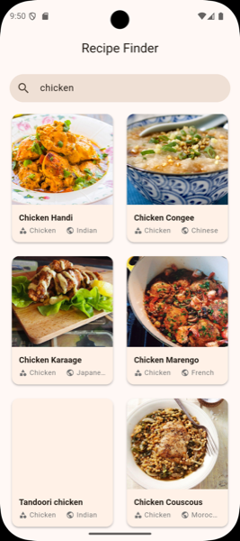
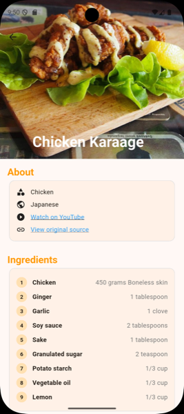
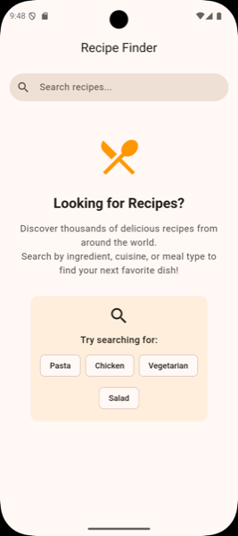

# Recipe Finder App 🍳

A Flutter application that allows users to search and view recipes using [TheMealDB](https://www.themealdb.com/) API. Built with Clean Architecture and Riverpod for state management.

## Features ✨
- Search recipes by keyword
- View recipe details with ingredients and instructions
- Clean Architecture implementation
- Riverpod state management
- Elegant UI with loading/error states

<!-- ## Project Structure 🏗️
lib/
├── core/
│ ├── constants/ # App constants and configurations
│ ├── errors/ # Failure classes and error handling
│ ├── network/ # Network-related utilities
│ ├── providers/ # Global providers
│ ├── utils/ # Utility classes
│ └── widgets/ # Reusable core widgets
├── features/
│ └── recipe/ # Recipe feature
│ ├── data/ # Data layer
│ │ ├── datasources/ # Data sources (remote/local)
│ │ ├── models/ # Data models
│ │ └── repositories/ # Repository implementations
│ ├── domain/ # Domain layer
│ │ ├── entities/ # Business objects
│ │ ├── repositories/ # Repository interfaces
│ │ └── usecases/ # Business logic
│ └── presentation/ # Presentation layer
│ ├── pages/ # Screens
│ ├── providers/ # Feature providers
│ ├── widgets/ # Feature widgets
│ └── recipe_theme.dart # Theme data
└── main.dart # App entry point -->

## State Management ⚙️
- Uses **Riverpod** providers to manage:
  - Search state (loading/success/error)
  - Recipe data
  - UI state
- State changes automatically trigger UI updates

## Installation & Running 🚀
1. Ensure you have Flutter installed (version 3.0 or later)
2. Clone this repository
3. Run `flutter pub get` to install dependencies
4. Run `flutter run` to start the app

## Dependencies
- flutter_riverpod: State management
- http: For API calls
- connectivity_plus: For network status
- dartz: For functional programming (Either type)

## API Used
The app uses [TheMealDB](https://www.themealdb.com/api.php) public API.

## Demo
You can View the Apk [Demo](https://appetize.io/app/b_7ngrcboipxwtrzuu3lg7cmcd3q)  here.

## Screenshots

